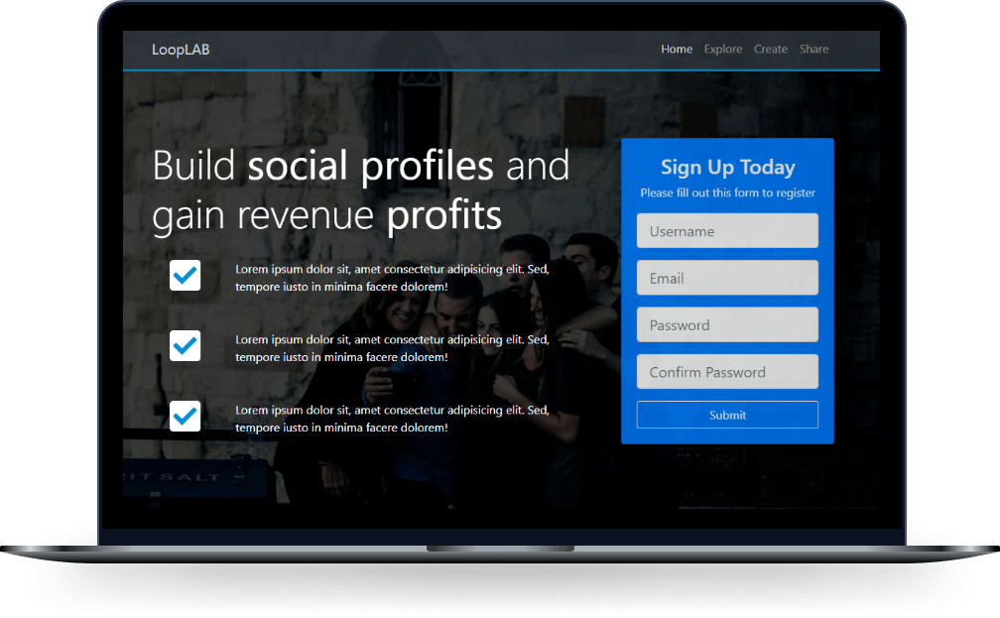

# LoopLab - Social Profiles
<!---------- Title/ Logo -------------->
<!-- <h1 align="center">
  
</h1> -->

 <!-- ------- Ancoras --------------->
<p align="center">
  <a href="#-sobre">Sobre</a>&nbsp;&nbsp;&nbsp;|&nbsp;&nbsp;&nbsp;
  <!-- <a href="#-projeto">Projeto</a>&nbsp;&nbsp;&nbsp;|&nbsp;&nbsp;&nbsp; -->
  <a href="#-telas">Telas</a>&nbsp;&nbsp;&nbsp;|&nbsp;&nbsp;&nbsp;
  <a href="#-tecnologias">Tecnologias</a>&nbsp;&nbsp;&nbsp;|&nbsp;&nbsp;&nbsp;
  <a href="#-licença">Licença</a>
</p>  

<!---------- Badges ----------------->  
<p align="center">
  

  

  

  
  <!----(4953b8)--BluePurple -->
  <!----(49AA26)--Green -->
  <!----(008ed6)--Blue -->
  <!----(3292a6)--BlueMedium-->
  </p>
  <br>

<!---------- showcase  ----------------->  
<p align="center">
  
</p>

<!----- Acess Deploy Demonstration-->
 <h5 align="center">
    🎬 Clique Aqui: &nbsp; <a href="https://loop-lab.vercel.app/">  Visualizar Demonstração </a> 
 </h5>

<!----- Description ------------------>

## 🔖 Sobre

&nbsp;&nbsp;&nbsp;&nbsp;Neste Projeto aprendi a desenvolver um modelo básico, porem bem elaborado de uma **Landing Page**, onde a ideia principal foi de reproduzir um site no formato simular a uma pagina de **Mídia Social**.
&nbsp;&nbsp;Neste exemplo utilizo blocos flexíveis com alinhamento de textos e imagens responsivas, incluído formulários no formato **Flex Mobal**, incluindo um nav bar para para explorar conteúdos por seções, também adicionei imagens de background com transparência em 2 planos com os objetos em sobreposição alem de boas praticas na execução das técnologias utilizadas.
&nbsp;&nbsp;Ao final da pagina no roda pé, inclui um botão que abrirá um pequeno **Form -Modal**, tendo como exemplos alguns campos de um formulário de cadastro.

<br>

###### **Curso :**  Bootstrap 4 and learning HTML5 semantics & CSS3- [Udemy](https://Udemy.com.br)
###### **Instrutor :** Brad Traversy

<br>

<!----- Showcase Screens Shot------------------>

## 💻 **Telas**

<div align="center">
  
  
  
  
</div>
<br>
<br>

<!----- Configurations ---------------------------->

## 📌 Instruções : 
&nbsp;&nbsp;&nbsp;&nbsp;Para iniciar o Servidor da aplicação utilizando o **VsCode** use o comando: **_Open Whit Live Server_** então acesse pelo navegador **_http://127.0.0.1:5500/index.html_** 

<br>

## 🚀 **Tecnologias**

- [HTML5](https://pt.wikipedia.org/wiki/HTML5) - Hyper Text Markup Language - Linguagem de marcação de hipertexto.
- [CSS3](https://pt.wikipedia.org/wiki/CSS3) - Cascading Style Sheets - Estilização de código html.
- [Java Script](https://www.javascript.com/) -  Linguagem de programação utilizada em páginas web. Com o JS.
- [Bootstrap 4](https://getbootstrap.com/docs/4.1/getting-started/download/) - Framework de componentes de interface(front-end) web e mobile-first.
- [VS Code](https://code.visualstudio.com/) - Editor de desenvolvimento de aplicações web.

<br>

## 📝 Licença
<a href="https://opensource.org/licenses/MIT">
    
</a>

 &nbsp;&nbsp;&nbsp;&nbsp;Esse projeto está sob a licença MIT. Veja o arquivo [LICENSE](https://opensource.org/licenses/MIT) para mais detalhes.

 <br>

## 📁 Como Baixar o Projeto
```bash
  # Clonar o repósitorio
  $ git clone https://github.com/alxlima/LoopLAB.git
  
  # Entrar no diretório
  $ cd c:/looplab

  # Instalar as dependências
  $ npm install
  
  # Iniciar o Projeto
  $ npm start
```
---
 Desenvolvido 🚀 por: ***_Alex Sandro da Silva lima_***

[](https://www.linkedin.com/in/alex-sandro-da-silva-lima-8b297839/) 
[](mailto:alex_lima2013@hotmail.com)
