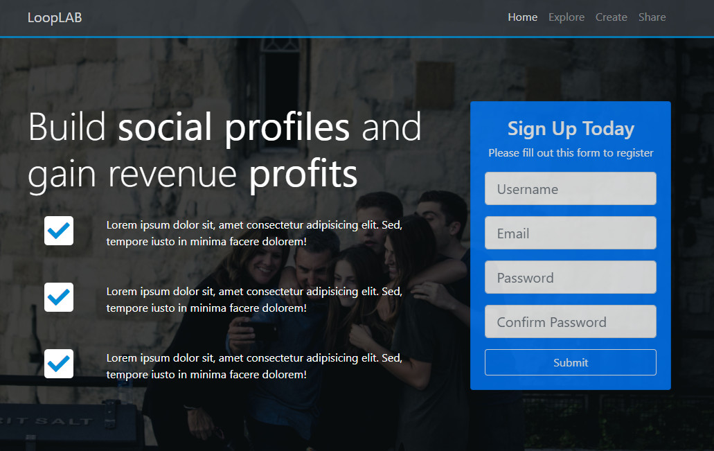
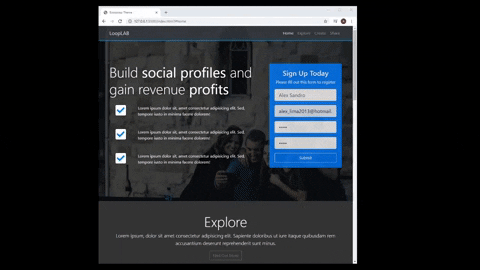
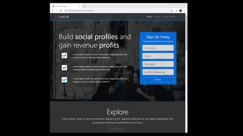
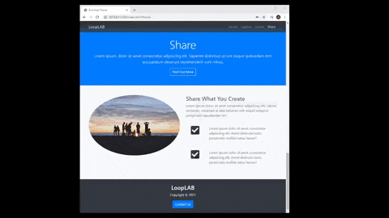

# LoopLab - Social Profiles

<div align="center">
<!--  -->

</div>
 
 <h5 align="center">
   <a hef="https://loop-lab.vercel.app/"> Acessar a Demostração </a> 
 </h5>

---

# Indice
- [Sobre](#-Sobre)
- [Tecnologias Utilizadas](#-Tecnologias-Utilizadas)
- [Como Baixar o Projeto](#-Como-Baixar-o-Projeto)

## 🔖 Sobre

  #####   Neste Projeto aprendi a desenvolver um modelo básico, porem bem elaborado de uma **Landing Page**, onde a ideia principal foi de reproduzir um site no formato simular a uma pagina de **Mídia Social**.
  ##### Neste exemplo utilizo blocos flexíveis com alinhamento de textos e imagens responsivas, incluído formulários no formato **Flex Mobal**, incluindo um nav bar para para explorar conteúdos por seções, também adicionei imagens de background com transparência em 2 planos com os objetos em sobreposição alem de boas praticas na execução das técnologias utilizadas.
  #####   Ao final da pagina no roda pé, inclui um botão que abrirá um pequeno **Form -Modal**, tendo como exemplos alguns campos de um formulário de cadastro.


###### **Curso :**  Bootstrap 4 and learning HTML5 semantics & CSS3- [Udemy](https://Udemy.com.br)
###### **Instrutor :** Brad Traversy
---

## 📌 Instruções : 
Para iniciar o Servidor da aplicação utilizando o **VsCode** use o comando: **_Open Whit Live Server_** então acesse pelo navegador **_http://127.0.0.1:5500/index.html_** 


## 🚀 **Tecnologias utilizadas**
- **HTML** - Front-End;
- **CSS3** - Front-End;
- **Bootstrap 4** (Template Engine) - Front-End
---

## 💻 **Prints**

<div align="center">




</div>
<br>

---

## 📁 Como Baixar o Projeto
```bash
  # Clonar o repósitorio
  $ git clone https://github.com/alxlima/LoopLAB.git
  
  # Entrar no diretório
  $ cd c:/looplab

  # Instalar as dependências
  $ yarn install
  
  # Iniciar o Projeto
  $ yarn start
```
---
 Desenvolvido 🚀 por: ***_Alex Sandro da Silva lima_***